# Event Storming: границы через события

В [ДЗ №3](04-capabilities.md) я шёл сверху вниз: выписал возможности, разметил поддомены и нарезал по ним сервисы. Способ рабочий, но у него есть слабое место — возможности я формулировал сам, из головы, и границы получились ровно такими, какими я их себе представлял. Проверить их этим же методом нельзя: инструмент и результат сделаны из одного материала.

Event Storming идёт снизу вверх, от того, что реально происходит в системе. Сначала выписываем события, потом смотрим, во что они сами собираются, и только после этого сверяемся с прошлым разбором. Если границы сойдутся — хорошо, есть два независимых подтверждения. Если разойдутся — ещё лучше, потому что расхождение всегда указывает на что-то, чего первый способ не увидел.

## Нотация

Цвета стикеров дальше везде одни и те же:

| Цвет | Что это | Как формулируем |
|------|---------|-----------------|
| 🟧 оранжевый | **доменное событие** — факт, который уже случился | прошедшее время: «Заказ оформлен» |
| 🟦 синий | **команда** — намерение что-то сделать | повелительное: «Оформить заказ» |
| 🟨 жёлтый | **актор** — кто отдаёт команду | роль, не должность |
| 🟪 розовый | **политика** или **внешняя система** | «когда произошло X → сделать Y» |
| 🟥 красный | **hotspot** — спорное место, где надо договориться | вопрос, а не утверждение |

Главное правило — события в прошедшем времени и про процесс, а не про CRUD. «Заказ создан в базе» — это не доменное событие, это запись в таблицу; бизнес такими словами не разговаривает. «Заказ оформлен» — событие: после него мир стал другим.

## Шаг 1. Доска

Доску держу в двух частях. Сначала путь покупки целиком, потом зум внутрь сервиса уведомлений — того, который мы ведём через весь курс. Время везде идёт слева направо.

### Часть 1. Путь покупки

```mermaid
flowchart LR
    A1[Покупатель]:::act
    A2[Оператор склада]:::act

    C1[Добавить в корзину]:::cmd
    C2[Оформить заказ]:::cmd
    C3[Оплатить]:::cmd
    C4[Отгрузить заказ]:::cmd

    E1(Товар просмотрен):::evt
    E2(Товар добавлен в корзину):::evt
    E3(Заказ оформлен):::evt
    E4(Товар зарезервирован):::evt
    E5(Резерв снят по таймауту):::evt
    E6(Оплата проведена):::evt
    E7(Оплата отклонена):::evt
    E8(Заказ подтверждён):::evt
    E9(Заказ отменён):::evt
    E10(Заказ отгружен):::evt
    E11(Заказ доставлен):::evt

    P1[/"когда заказ оформлен<br/>→ зарезервировать товар"/]:::pol
    P2[/"когда резерв не оплачен за 30 мин<br/>→ снять резерв"/]:::pol
    P3[/"когда оплата проведена<br/>→ подтвердить заказ"/]:::pol
    P4[/"когда заказ подтверждён<br/>→ поставить в отгрузку"/]:::pol
    PSP[/"Платёжный провайдер"/]:::pol

    A1 --> C1 --> E2
    E1 --> C1
    A1 --> C2 --> E3
    E3 --> P1 --> E4
    E4 --> P2 --> E5 --> E9
    A1 --> C3
    C3 --> PSP
    PSP -.-> E6
    PSP -.-> E7
    E7 --> E9
    E6 --> P3 --> E8
    E8 --> P4
    A2 --> C4
    P4 --> C4 --> E10 --> E11

    H1{{"оплата прошла,<br/>а резерв уже снят —<br/>компенсируем или разбираем руками?"}}:::hot
    E5 --- H1
    E6 --- H1

    classDef evt fill:#FFB570,stroke:#D79B00,color:#000000
    classDef cmd fill:#DAE8FC,stroke:#6C8EBF,color:#000000
    classDef act fill:#FFF2CC,stroke:#D6B656,color:#000000
    classDef pol fill:#FFCCE5,stroke:#B5739D,color:#000000
    classDef hot fill:#F8CECC,stroke:#B85450,color:#000000
```

### Часть 2. Зум внутрь уведомлений

Сюда события приходят не от человека, а от других контекстов — поэтому акторов здесь нет вообще, и это само по себе наблюдение.

```mermaid
flowchart LR
    IN[/"Заказы · Оплата · Доставка<br/>(издатели событий)"/]:::pol
    PROV[/"SMTP · SMS-провайдер"/]:::pol

    C1[Принять заявку]:::cmd
    C2[Отправить сообщение]:::cmd
    C3[Повторить отправку]:::cmd

    E1(Заявка на уведомление принята):::evt
    E2(Повтор по тому же ключу отклонён):::evt
    E3(Шаблон отрендерен):::evt
    E4(Канал доставки выбран):::evt
    E5(Сообщение передано провайдеру):::evt
    E6(Сообщение доставлено):::evt
    E7(Провайдер вернул временный сбой):::evt
    E8(Повтор запланирован):::evt
    E9(Повторы исчерпаны):::evt
    E10(Сообщение переведено в DLQ):::evt

    P1[/"когда ключ идемпотентности уже виден<br/>→ второе сообщение не создавать"/]:::pol
    P2[/"когда провайдер вернул временный сбой<br/>→ повторить с нарастающей задержкой"/]:::pol
    P3[/"когда повторов было 5<br/>→ увести в DLQ и ждать разбора"/]:::pol

    IN -.-> C1
    C1 --> P1
    P1 --> E2
    P1 --> E1
    E1 --> E3 --> E4 --> C2 --> E5
    E5 --> PROV
    PROV -.-> E6
    PROV -.-> E7
    E7 --> P2 --> E8 --> C3 --> E5
    E8 --> P3
    P3 --> E9 --> E10

    H2{{"письмо доставлено провайдеру,<br/>но не открыто получателем —<br/>это «доставлено» или нет?"}}:::hot
    E6 --- H2

    classDef evt fill:#FFB570,stroke:#D79B00,color:#000000
    classDef cmd fill:#DAE8FC,stroke:#6C8EBF,color:#000000
    classDef act fill:#FFF2CC,stroke:#D6B656,color:#000000
    classDef pol fill:#FFCCE5,stroke:#B5739D,color:#000000
    classDef hot fill:#F8CECC,stroke:#B85450,color:#000000
```

Редактируемая доска — [`views/diagrams/event-storming.drawio`](views/diagrams/event-storming.drawio).

### Что видно на доске

Три вещи, которых на бумаге с возможностями не было.

**Политики с таймером.** «Резерв не оплачен за 30 минут → снять резерв» — это поведение, растянутое во времени, и владеет им склад. В [ДЗ №3](05-service-boundaries.md) склад выглядел как хранилище чисел; на доске выяснилось, что у него есть собственная жизнь.

**Развилки.** У оплаты два исхода, у отправки сообщения — три (доставлено, временный сбой, окончательный отказ). Список возможностей развилок не показывает вовсе: «приём оплаты» звучит как одна прямая линия.

**Два hotspot'а.** Оба про случаи, которые я до доски не рассматривал. Первый — гонка между снятием резерва и приходом оплаты. Второй — что вообще считать доставкой: сдали провайдеру или получатель прочитал. Второй вопрос прямо задевает [S1 и меру «потерь ноль»](02-utility-tree.md): пока мы не договорились, где заканчивается наша ответственность, мера не проверяема. Оставляю оба красными, это честнее, чем задним числом придумать ответ.

## Шаг 2. Bounded Context

Теперь обвожу события, которые ходят вместе. Критерий: события одного кластера случаются одной цепочкой и говорят на одном языке. Получилось шесть контекстов.

### 1. Каталог

**События:** товар просмотрен.

**Язык:** товар, категория, атрибут, поисковый запрос.

**Владеет:** карточками товаров и поисковым индексом.

### 2. Заказы

**События:** товар добавлен в корзину, заказ оформлен, заказ подтверждён, заказ отменён.

**Язык:** корзина, позиция, заказ, статус заказа, плательщик.

**Владеет:** корзинами, заказами, позициями.

### 3. Склад

**События:** товар зарезервирован, резерв снят по таймауту.

**Язык:** остаток, резерв, срок резерва.

**Владеет:** остатками и резервами.

Кластер проступил именно из-за политики с таймером — без неё склад так и остался бы табличкой чисел внутри заказов.

### 4. Оплата

**События:** оплата проведена, оплата отклонена.

**Язык:** платёж, возврат, сумма, платёжный провайдер.

**Владеет:** платежами и возвратами.

### 5. Доставка

**События:** заказ отгружен, заказ доставлен.

**Язык:** отгрузка, маршрут, адрес доставки.

**Владеет:** отгрузками и маршрутами.

### 6. Уведомления

**События:** заявка принята, повтор по ключу отклонён, шаблон отрендерен, канал выбран, сообщение передано провайдеру, доставлено, временный сбой, повтор запланирован, повторы исчерпаны, переведено в DLQ.

**Язык:** заявка, получатель, канал, шаблон, ключ идемпотентности, повтор, DLQ.

**Владеет:** заявками, историей статусов, шаблонами, маршрутизацией «канал → провайдер».

Событий здесь больше, чем во всех остальных контекстах вместе взятых, — но это не потому, что контекст важнее. Просто его я рассматриваю с близкого расстояния, а остальные с далёкого. Полезное напоминание: размер кластера на доске говорит о масштабе взгляда, а не о значимости куска системы.

### Один термин — разные модели

Три слова, которые в разных контекстах означают разное, и это как раз то, что удерживает границы.

**Заказ.** В контексте заказов это состав и статус. В доставке — вес, габариты и адрес; состав ей неинтересен. В уведомлениях заказа нет вообще, есть только его номер в тексте письма.

**Клиент.** В заказах это плательщик со скидкой, в доставке — адресат, в уведомлениях — **получатель** с каналом и контактом. Три разные модели, [и сводить их в одну нельзя](05-service-boundaries.md#клиент-и-получатель--разные-модели).

**Доставка.** В контексте доставки это физическая отгрузка. В уведомлениях — доставка сообщения. Одно слово, два совершенно разных процесса, и если бы они оказались в одном контексте, разговор в команде развалился бы на первой же фразе.

## Шаг 3. Context Map

Связи между контекстами и их типы вынесены отдельно: [`views/context-map.md`](views/context-map.md).

## Шаг 4. Сверка с ДЗ №3

В ДЗ №3 получилось [восемь сервисов](05-service-boundaries.md), здесь — шесть контекстов. Сравниваю.

| Сервис из ДЗ №3 | Контекст из ДЗ №4 | Итог |
|-----------------|-------------------|------|
| Каталог | Каталог | совпало |
| Рекомендации | — | **не проступил** |
| Склад | Склад | совпало, и граница окрепла |
| Заказы | Заказы | совпало, но корзина чуть не отделилась |
| Оплата | Оплата | совпало |
| Доставка | Доставка | совпало |
| Уведомления | Уведомления | совпало, внутри виден свой процесс |
| Авторизация | — | **не проступил** |

Шесть из восьми сошлись один в один — декомпозиция от возможностей выдержала проверку. Интереснее оставшиеся четыре строки.

### Расхождение 1. Два сервиса на доске не появились

Ни рекомендации, ни авторизация не дали ни одного кластера событий. Сначала я решил, что ошибся в ДЗ №3, но нет — причина в методе.

Event Storming находит границы там, где есть **процесс**, разворачивающийся во времени. У авторизации процесса в пути покупки нет: она срабатывает точечно, до начала и вне цепочки. У рекомендаций тоже — подборка это запрос-ответ, а не последовательность фактов.

Из этого следует вывод, который стоит запомнить: **Event Storming не универсален**. Он отлично видит контексты с поведением и слеп к тем, что живут запросами. Если бы я строил декомпозицию только на нём, я бы потерял два сервиса из восьми. Поэтому методы не заменяют друг друга: разбор возможностей находит всё, но обосновывает слабо; Event Storming обосновывает сильно, но находит не всё.

### Расхождение 2. Корзина чуть не отделилась

На доске «товар добавлен в корзину» стоит особняком: между ним и «заказ оформлен» проходит время, у него свой язык (позиция, количество) и свой актор. Строго по кластерам здесь напрашивался седьмой контекст, и это разошлось бы с ДЗ №3, где я корзину [сознательно оставил внутри заказов](05-service-boundaries.md#4-заказы-возможность-4-core).

Всё-таки не разделяю, но теперь у меня аргумент лучше прежнего. В ДЗ №3 я говорил «корзина — это черновик заказа», что скорее метафора. Доска даёт проверяемый признак: **у корзины нет ни одной собственной политики**. Все её события ведут в оформление, ни одно правило не срабатывает внутри неё самой. Контекст без собственного поведения — это не контекст, а часть чужого.

### Расхождение 3. У склада появилось поведение

Обратный случай. В ДЗ №3 склад был описан данными: владеет остатками и резервами. На доске у него нашлась политика с таймером — «резерв не оплачен за 30 минут → снять». Это уже не хранилище, а участник процесса, который сам, без внешней команды, меняет состояние системы.

Граница от этого не сдвинулась, но окрепла: раньше склад можно было заподозрить в том, что он просто таблица внутри заказов, теперь — нет.

### Расхождение 4. Внутри уведомлений оказался процесс

В ДЗ №3 сервис уведомлений выглядел плоско: подписчик, который получает три события и что-то с ними делает. Зум показал внутри полноценный таймлайн с тремя политиками — дедупликация по ключу, повтор с нарастающей задержкой, уход в DLQ после пятого раза.

Это ретроспективно оправдывает [ADR-0001](adr/0001-async-delivery-via-queue.md). Решение про очередь я принимал из требований к качеству — пики и ненадёжные провайдеры. Доска показывает то же самое с другой стороны: три политики из трёх растянуты во времени, а растянутое во времени поведение синхронным вызовом не выражается в принципе. Хороший знак — когда решение, принятое одним способом, подтверждается другим.

### Расхождение 5. Появились вопросы, которых не было

Два hotspot'а — гонка резерва с оплатой и определение «доставлено» — в ДЗ №3 не возникли вообще. Разбор возможностей их и не мог найти: он описывает, что система умеет, а не что происходит, когда два процесса пересекаются во времени.

### Вывод

Границы Event Storming не сломал: шесть контекстов из восьми сервисов совпали, а два несовпадения объясняются ограничением самого метода, а не ошибкой декомпозиции. Но он добавил три вещи, которых взгляд от возможностей не давал: поведение у склада, отсутствие собственного поведения у корзины и два вопроса, на которые ещё предстоит ответить.

И дал понимание, зачем вообще делать оба шага. Возможности отвечают на вопрос «из чего состоит система». События — на вопрос «как она живёт». Границы, устоявшие после обоих вопросов, я готов защищать.
