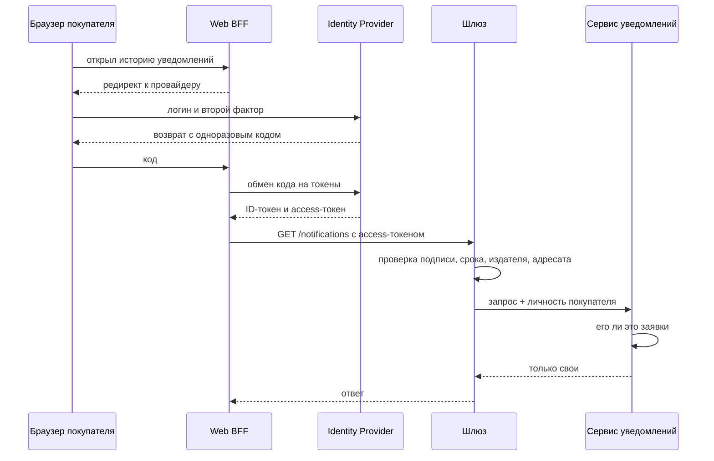

# Аутентификация и авторизация: кто входит и что ему можно

Задание шестнадцатого вебинара. К этому моменту у сервиса уже описан слой входа — [`09-entry-layer.md`](09-entry-layer.md) и [ADR-0003](adr/0003-entry-layer-gateway-and-bff.md), — и там одной строкой сказано, что шлюз отвечает «кто это», а «можно ли ему именно эту заявку» решает сервис уведомлений. Здесь я эту строку разворачиваю: кто у сервиса пользователи, как они входят, по какой модели считаются права и где именно проверяется принадлежность заявки.

Своих экранов у сервиса нет. Он отдаёт данные двум чужим клиентам — личному кабинету покупателя и админке поддержки, — а работу получает событиями из брокера. Из-за этого разговор про доступ у него распадается на две несвязанные половины: доступ людей на чтение и доступ сервисов на запись. Обе разбираю ниже.

## Шаг 1. Кто пользователи и что каждый делает

| Роль | Откуда приходит | Что видит и делает | Чего не должна мочь |
|------|-----------------|--------------------|---------------------|
| Покупатель | личный кабинет магазина (Web BFF, Mobile BFF) | свою историю уведомлений: что отправлено, когда, каким каналом | видеть чужую историю; видеть тело SMS и адрес почты в чужой заявке |
| Оператор поддержки | админка (Admin BFF) | уведомления по конкретному заказу, статус доставки, причину отказа | менять шаблоны; смотреть заявки вне своей очереди |
| Администратор уведомлений | админка (Admin BFF) | шаблоны, каналы, правила повторов | подменять уже отправленное; читать историю выборочно по покупателям |
| Сервис-издатель (заказы, оплата, доставка) | брокер, не HTTP | публикует событие «отправь уведомление» | читать историю; вызывать административные операции |
| Сервис-читатель (BFF) | внутренняя сеть | запрашивает историю от имени пользователя | приходить без пользовательского контекста |

Две нижние строки — не люди, и это принципиально. Их проверяют другим механизмом и в другом месте, и смешивать их с ролями людей в одной таблице прав нельзя: у человека роль меняется в кадровой системе, у сервиса — при перевыкатке.

Отдельно отмечаю то, что вылезло при заполнении таблицы: **у оператора поддержки и покупателя один и тот же экран данных, но разные основания доступа**. Покупатель видит заявку, потому что она его. Оператор — потому что заказ в его очереди. Одна и та же строка истории отдаётся по двум разным правилам, и это ровно тот случай, ради которого дальше понадобится ABAC.

## Шаг 2. Как устроен вход

Пароли сервис уведомлений не проверяет и проверять не будет. Вход целиком отдан провайдеру магазина, сервис принимает результат.

Что где происходит:

- **Провайдер** — единственное место, где живут пароли и второй фактор. Один вход открывает и кабинет, и админку, права при этом разные.
- **Шлюз** проверяет токен: подпись ключом провайдера, алгоритм по своему списку разрешённых, срок годности, издателя и адресата. Дальше внутрь идёт запрос с уже установленной личностью.
- **Сервис уведомлений** токен повторно не разбирает. Он получает личность пользователя от шлюза и работает с ней — и именно он решает вопрос про принадлежность, потому что только он знает адресата заявки.

Токен беру JWT: сервис читает историю на каждом открытии экрана, и поход к провайдеру на каждый такой запрос был бы лишним. Пара access и refresh: access живёт 15 минут, refresh — сутки и отзывается у провайдера. Мгновенного отзыва access нет, и это осознанная плата — окно вреда равно времени жизни токена.

Про хранение на клиенте решаю не я, а команда магазина: экраны чужие. В контракте фиксирую только то, что касается сервиса — токен приходит заголовком `Authorization`, и адресат (`aud`) в нём должен указывать на API уведомлений, иначе токен, выписанный для другого сервиса, здесь не примут.

**Межсервисный вход** идёт мимо этой схемы. Издатели не ходят по HTTP вовсе — они кладут событие в брокер, и там их аутентифицирует сам брокер. BFF, которые читают историю, приходят по mTLS: сертификат выдаёт кластер, и это уже развёрнуто, отдельных сервисных токенов заводить не стал. В запросе от BFF едут **две личности сразу** — сервиса (кто вызывает) и пользователя (от чьего имени). Терять вторую нельзя: без неё сервис не сможет ответить на вопрос про принадлежность и вынужден будет отдать всё.

## Шаг 3. Какая модель авторизации

Взял **RBAC как основу и ABAC поверх него для двух правил**.

Ролей у сервиса четыре, они меняются редко и хорошо читаются в аудите — на этом RBAC заканчивает работу и отвечает на вопрос «пускать ли вообще к этому разделу». Но два правила через роли не выражаются:

1. Покупатель видит **свои** заявки. Роль «покупатель» одна на всех, а видимый набор строк у каждого свой. Заводить роль на покупателя — это миллион ролей.
2. Оператор поддержки видит заявки **своей очереди**. Очередь — атрибут заказа и атрибут оператора, а не роль. Разбить операторов по ролям на очереди можно, но очереди меняются чаще, чем состав ролей, и каждый такой переезд превращается в правку прав.

Оба правила — про сравнение атрибута субъекта с атрибутом объекта, то есть ровно ABAC. При этом полный ABAC на всё я не беру: правило «администратор управляет шаблонами» прекрасно выражается ролью, и переводить его в атрибуты значит терять читаемость там, где она была бесплатной.

MAC не рассматривал. Меток секретности, заданных снаружи, у нас нет, регулятор состав доступа не диктует.

Решение о доступе принимает **сам сервис**, выделенного policy-сервиса не завожу: правил всего два, они про данные сервиса, и вынести их наружу означало бы дать policy-сервису знать про адресатов заявок и очереди операторов.

| Правило | Модель | Где считается |
|---------|--------|---------------|
| Пускать ли к разделу «история» / «шаблоны» | RBAC по роли | шлюз |
| Заявка принадлежит этому покупателю | ABAC: `subject.id == notification.recipientId` | сервис уведомлений |
| Заказ в очереди этого оператора | ABAC: `subject.queues ∋ order.queue` | сервис уведомлений |
| Тело сообщения и контакт видны | RBAC: только роль оператора и администратора | сервис уведомлений |

## Шаг 4. Где проверяется принадлежность

Операции, где недостаточно роли и проверяется сам объект:

| Операция | Что проверяется | Место проверки |
|----------|-----------------|----------------|
| `GET /notifications` — история покупателя | каждая строка выборки принадлежит вошедшему | сервис, в условии запроса к БД |
| `GET /notifications/{id}` — одна заявка | адресат заявки совпадает с вошедшим либо заказ в очереди оператора | сервис, до отдачи ответа |
| `GET /orders/{id}/notifications` — заявки по заказу в админке | заказ в очереди оператора | сервис, запросом к заказам за атрибутом очереди |
| `POST /notifications/{id}/resend` — повторная отправка | адресат прежний, оператор из очереди этого заказа | сервис, до постановки в очередь |

Три вещи, которые я записал себе отдельно, потому что на них легко обжечься:

- **Проверка принадлежности живёт в условии выборки, а не в фильтрации после неё.** Отфильтровать полученный список — значит однажды забыть отфильтровать и отдать всё. Условие в запросе к БД такой возможности не оставляет.
- **На шлюз это вынести нельзя.** Шлюз не знает адресата заявки и очередь оператора, и узнать может только сходив в сервис — то есть проверка всё равно окажется в сервисе, просто через лишний сетевой вызов.
- **`GET /notifications/{id}` с чужим идентификатором обязан отдавать 404, а не 403.** Ответ «нет прав» подтверждает, что такая заявка существует, и по перебору идентификаторов из этого собирается картина чужих заказов.

Решение о месте проверки записал отдельно: [ADR-0005](adr/0005-access-check-in-service.md).

## Что осталось за границей задания

Явно называю, чтобы не выглядело забытым. Ротация ключей провайдера и кеширование JWKS — эксплуатация, к модели доступа отношения не имеет. Аудит доступа (кто и какую заявку открыл) нужен и будет отдельной работой в блоке наблюдаемости. Согласие покупателя на канал связи — это про персональные данные, а не про авторизацию, и живёт в профиле магазина.

## Как оформить это у себя

1. Начните с таблицы ролей и обязательно заполните колонку «чего не должна мочь». Она находит правила, которые через роль не выражаются, — а это и есть развилка между RBAC и ABAC.
2. Нарисуйте вход одной диаграммой и подпишите на ней, **где проверяется подпись токена**. Если такого места на схеме нет, значит оно не продумано, а не «подразумевается».
3. Выберите модель авторизации и назовите **правило своей темы**, которое к ней вынудило. Формулировка «взял ABAC, он гибче» ничего не объясняет; работает «взял ABAC, потому что видимость строки зависит от адресата, а роль на каждого адресата не заведёшь».
4. Выпишите операции, где проверяется сам объект, и рядом — место проверки. Ровно здесь обнаруживается забытая проверка владельца: она не забывается в коде, она забывается в списке.
5. Отдельной строкой решите, что делает сервис с чужим идентификатором — 403 или 404. Ответ зависит от того, секретен ли факт существования объекта в вашей теме.

Ориентир по объёму: одна-две страницы. Как и в прошлые разы, ценность в обоснованиях: таблица без колонки «почему» проверку не проходит.
