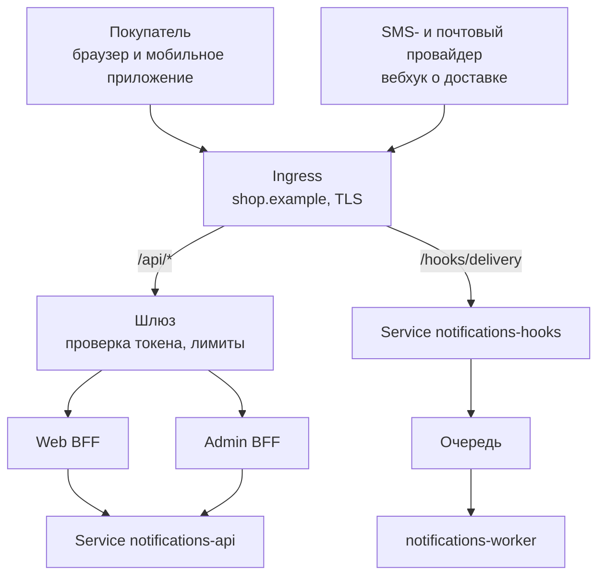

# Сервис в кластере: базовые объекты и что мешает быть stateless

Задание семнадцатого вебинара. Занятие обзорное — «понимать, не администрировать», — поэтому и здесь нет ни одного манифеста. Задача другая: разложить сервис уведомлений на объекты кластера и увидеть, что из уже принятых решений при этом ломается.

Сломалось три вещи, и все три оказались интереснее самой раскладки. Их и разбираю ниже: сервис не влезает в один Deployment, вебхук провайдера не влезает в общий вход, а окно дедупликации из [ADR-0001](adr/0001-async-delivery-via-queue.md) не переживает пересоздание Pod.

## Шаг 1. Что станет Deployment, а что Service

Начинал я с наивной строки «сервис уведомлений — один Deployment и один Service» и на ней же застрял. У сервиса два входа с несовместимыми профилями нагрузки: HTTP-запросы на чтение приходят от людей, которые смотрят на экран, а события из брокера обрабатываются пачками и в своём темпе. Реплицировать их вместе — значит масштабировать чтение истории ради всплеска рассылки.

| Часть сервиса | Deployment | Service | Почему так |
|---|---|---|---|
| HTTP API: история, настройки, код подтверждения | `notifications-api` | `notifications-api` (ClusterIP) | к нему обращаются BFF, значит нужно стабильное имя |
| Обработчик событий из брокера | `notifications-worker` | **не нужен** | к нему никто не обращается по сети, он сам ходит в брокер |
| Приём вебхуков провайдера | `notifications-hooks` | `notifications-hooks` (ClusterIP) | внешний вызов приходит по HTTP, ему нужен адресат |

Три Deployment и **два** Service. Пустая строка в третьей колонке — самый полезный результат шага: **Service заводится тому, к кому кто-то обращается по сети, а не каждому Deployment за компанию.** Обработчик событий инициирует все свои связи сам, входящих вызовов у него нет, и Service ему нечего было бы адресовать.

Образ при этом один. Разные Deployment запускают его с разной конфигурацией — какие части поднимать, — и это оставляет сборку одной, а раскладку разной. Решение записал отдельно: [ADR-0006](adr/0006-split-api-and-worker-deployments.md).

Соседи по системе раскладываются так же и без сюрпризов: восемь доменных сервисов дают восемь Deployment со своими Service, три BFF — три пары, шлюз — свою. Брокер, база и общий кеш в этот список не попадают: их в кластере или нет вовсе (управляемые сервисы провайдера), или они живут по другим правилам, чем приложение без состояния.

## Шаг 2. Как устроен вход снаружи

Наружу смотрят два пути, и они разные настолько, что общее правило для них не пишется.

Пользовательский путь идёт `shop.example/api/*` в шлюз и дальше в BFF — так, как записано в [ADR-0003](adr/0003-entry-layer-gateway-and-bff.md). Ingress здесь занят транспортом: домен, путь, терминация TLS. Всё прикладное — проверка токена, лимиты, агрегация — живёт в шлюзе и BFF за ним, и раскладка на объекты кластера этой границы не трогает.

Вебхук провайдера — второй путь, и он показал дыру. Провайдер приходит снаружи, но **токена у него нет**: он не пользователь магазина и через провайдера входа не проходил. Пустить его через шлюз означало бы завести на шлюзе исключение «этот путь без аутентификации», то есть дырку в единственном месте, где аутентификация обязана быть безусловной. Поэтому `/hooks/delivery` — отдельное правило Ingress мимо шлюза, а подлинность вызова сервис проверяет сам: подписью тела по общему секрету с провайдером. В [`12-interaction-model.md`](12-interaction-model.md) сценарий 11 описан как «отвечаем 200 и кладём в очередь» — теперь у него есть и точка входа.

Один внешний адрес, один сертификат, два правила маршрутизации. NodePort и LoadBalancer на отдельные сервисы не завожу: они дали бы столько же внешних адресов, сколько сервисов, и столько же сертификатов.

## Шаг 3. Настройки и секреты

Разделял по одному признаку: **в Secret идёт то, что нельзя показать соседней команде**. Всё остальное — ConfigMap, даже если выглядит внутренним.

| Значение | Где | Почему |
|---|---|---|
| Адрес брокера, имя топика, размер пачки | ConfigMap | адрес не тайна, а знание топологии |
| Адрес базы и общего кеша | ConfigMap | сам адрес не даёт доступа |
| Таймауты провайдеров, число повторов, окно дедупликации | ConfigMap | параметры поведения, меняются чаще всего остального |
| Список каналов и правила выбора шаблона | ConfigMap | доменная настройка, живёт дольше релиза |
| Пароль к базе, пароль к брокеру | Secret | прямой доступ к данным |
| Ключ SMS-провайдера, учётка SMTP | Secret | за них платят деньгами, утечка стоит рассылки от нашего имени |
| Общий секрет подписи вебхука | Secret | им проверяется подлинность входящего вызова из шага 2 |
| Ключ проверки подписи токенов | ConfigMap | это публичный ключ провайдера входа |

Последняя строка — та, на которой легко ошибиться и положить в Secret всё, что звучит как «ключ». Публичный ключ провайдера публичен по определению, он лежит в открытой точке провайдера, и прятать его — путать шифрование с гигиеной.

Один и тот же образ едет в dev, stage и prod, различаются только ConfigMap и Secret рядом. Число повторов и окно дедупликации сознательно вынес в конфигурацию, а не в код: их подкручивают по факту наблюдений, и пересборка образа ради такой правки означала бы, что в prod едет артефакт, который в этом виде нигде не проверяли.

## Шаг 4. Что мешает быть stateless

Прошёл по сервису и нашёл четыре места, где состояние живёт в памяти процесса. Три из них ломаются при пересоздании Pod, и одно оказалось настоящей ошибкой, а не мелочью.

| Что живёт в памяти | Что ломается при пересоздании | Куда выносим |
|---|---|---|
| **Окно дедупликации по `Idempotency-Key`** | дубли, отброшенные час назад, проходят заново — покупатель получает второе письмо | общий кеш с временем жизни, равным окну |
| Планировщик повторов неудавшихся отправок | отложенный повтор теряется вместе с Pod, уведомление не уходит вовсе | очередь с отложенной доставкой |
| Счётчики отправленного для отчёта за сутки | отчёт занижает числа после каждой выкатки | проекция в базе, как и записано в [`12-interaction-model.md`](12-interaction-model.md) |
| Кеш шаблонов | ничего: прогреется заново за первый запрос | остаётся в памяти |

Первая строка — то, ради чего задание стоило делать. В [ADR-0001](adr/0001-async-delivery-via-queue.md) идемпотентность приёма записана как обязанность сервиса, но где живёт окно дедупликации, там не сказано. В памяти оно и оказалось бы по умолчанию — и тогда обещание «повтор события не даёт второго письма» держалось бы ровно до ближайшей выкатки. Причём заметить это в тестах почти невозможно: они не пересоздают Pod между проверками.

Последняя строка тоже важна, но обратной стороной: **не всякое состояние в памяти обязано уезжать наружу.** Кеш шаблонов восстанавливается сам и никому ничего не обещает — выносить его значило бы платить сетевым вызовом за отсутствующую проблему.

### Пробы и ресурсы

Раз реплики взаимозаменяемы, кластеру нужно понимать, какая из них готова принимать трафик.

- **Проба готовности** у `notifications-api` отвечает утвердительно, когда есть соединение с базой: без базы отдавать историю нечем. Соединение с брокером в неё не входит — чтение истории от брокера не зависит, и завязка вывела бы из балансировки здоровые реплики при отказе, который их не касается.
- **Проба живости** проверяет только то, что процесс отвечает. Соблазн проверить в ней те же зависимости велик, и он ведёт к худшему из отказов: брокер лёг — кластер бесконечно перезапускает исправные контейнеры и добивает то, что ещё работало.
- У `notifications-worker` пробы готовности нет вовсе: трафик ему никто не направляет, направлять нечего.
- Запросы и лимиты ресурсов проставлю по измерениям под нагрузкой. Числа наугад тут вреднее их отсутствия: заниженный лимит по памяти даёт перезапуски, которые снаружи выглядят случайными падениями сервиса.

## Что осталось за границей задания

Хранилища (PersistentVolume), StatefulSet, Helm и service mesh я сознательно не трогал: занятие обзорное, и всё это отдельные темы. База, брокер и общий кеш у меня — управляемые сервисы за пределами кластера, поэтому вопрос «как хранить состояние внутри кластера» здесь не возник ни разу. Автомасштабирование по нагрузке тоже за границей: сначала нужны измерения из предыдущего пункта.

## Как оформить это у себя

1. Выпишите части своей системы и напротив каждой — Deployment и Service. Дойдя до части, к которой **никто не обращается по сети**, оставьте колонку Service пустой: это проверка, а не недоработка.
2. Нарисуйте вход одной схемой: домен, пути, что за каждым путём. Ищите путь, который приходит **не от пользователя** — вебхук, коллбэк платёжного провайдера, выгрузку партнёра. Такой путь почти всегда не укладывается в общее правило аутентификации, и это видно только на схеме.
3. Разложите настройки и секреты по двум колонкам, спрашивая про каждое значение: «покажу я это соседней команде?». Отдельно проверьте всё, что называется «ключ»: часть из них публичные.
4. Пройдите по коду и найдите, что живёт в памяти процесса между запросами. По каждой находке ответьте на два вопроса: что сломается при пересоздании Pod и восстановится ли оно само. Второе «да» означает, что выносить не надо.
5. Сформулируйте, чем отвечает проба готовности. Если в ответе перечислены все зависимости сервиса — вернитесь к пункту и вычеркните те, без которых сервис всё же может обслуживать часть запросов.
