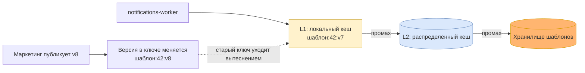

# Серверная кеш-стратегия сервиса уведомлений: что кешируем и на каких условиях

Это разбор с двадцать третьего занятия. На тринадцатом мы уже смотрели на кеш со стороны edge —
[точки кеширования](10-cache-points.md) и [инвалидация](11-invalidation-strategy.md), — но там речь
шла о том, что отдаётся покупателю через CDN. Здесь другая сторона: кеш внутри контура, рядом
с базой, который ускоряет дорогие чтения и снимает с базы нагрузку.

Наборы данных я не выдумываю заново — беру те же шесть, что размечены в
[модели согласованности](19-consistency-model.md#шаг-1-наборы-данных), и модули те же:
`notifications-api`, `notifications-worker`, адаптер канала, шаблоны, хранилище заявок,
контракт события.

Сразу оговорю рамку: кеш здесь ускоряет чтение, а истина остаётся в базе и в брокере. Ни один
набор ниже не становится таким, что потеря кеша теряет данные.

## Шаг 1. Что читают чаще, чем меняют

Кеш имеет смысл там, где на одну запись приходится много чтений и одно чтение стоит дорого.
Считаю оба числа по каждому набору.

| Набор | Чтений на одну запись | Чем дорого одно чтение | Кандидат в кеш |
|-------|----------------------|------------------------|----------------|
| **D1. Заявка** | одно: воркер читает её один раз | обычное чтение по первичному ключу | нет |
| **D2. Статус и попытки** | десятки: клиент опрашивает, поддержка смотрит историю | чтение плюс сборка истории попыток | да |
| **D3. Ключи идемпотентности** | одно на приём, но приёмов много | чтение по индексу на каждом событии | особый случай, см. шаг 3 |
| **D4. Шаблоны** | тысячи: каждая отправка берёт шаблон | чтение плюс разбор и подстановка полей | да, главный кандидат |
| **D5. Очередь и DLQ** | ноль: это не чтение, а доставка | вне кеша, гарантии у брокера | нет |
| **D6. Метрики и счётчики** | десятки на минуту: дашборд рисует плитки | агрегат по таблице заявок за окно | да |

Три кандидата из шести, и самый очевидный — шаблоны. Их меняет человек из маркетинга несколько
раз в неделю, а читает воркер на каждой отправке. Отношение чтений к записям тут самое высокое
в сервисе, и именно на этом наборе кеш даёт основной выигрыш.

## Шаг 2. Допустимое устаревание числом

Окна свежести у меня уже посчитаны в [модели согласованности](19-consistency-model.md#шаг-3-окно-свежести),
и TTL кеша не может быть больше окна — иначе кеш сам становится источником расхождения,
которое я там запретил.

| Набор | Окно из модели согласованности | TTL в кеше | Почему столько |
|-------|-------------------------------|------------|----------------|
| **D2. Статус** | ноль для автора заявки, до 2 секунд для остальных | 2 секунды | автор читает мимо кеша, остальным двух секунд хватает |
| **D3. Ключи** | ноль, всегда | TTL по времени не годится | промах означает дубль письма, см. шаг 3 |
| **D4. Шаблоны** | 60 секунд на раскатку новой версии | версия в ключе, TTL сутки | ключ с версией делает устаревание невозможным |
| **D6. Метрики** | 60 секунд | 60 секунд | ровно интервал сбора из [плана observability](17-observability-plan.md#шаг-2-какие-метрики-и-по-какой-модели) |

Строка про метрики — тот случай, когда кеш достаётся бесплатно: дашборд всё равно показывает
данные минутной давности, и агрегат за ту же минуту можно считать один раз вместо каждого рендера.

## Шаг 3. Паттерн и политика вытеснения

| Набор | Где кешируем | Паттерн | Вытеснение | Почему так |
|-------|--------------|---------|------------|------------|
| **D2. Статус** | распределённый кеш | cache-aside | LRU по памяти плюс TTL 2 секунды | статус читают по свежим заявкам, старые уходят сами |
| **D3. Ключи** | распределённый кеш | write-through, без вытеснения по памяти | только TTL, равный окну дедупликации | подробнее ниже |
| **D4. Шаблоны** | два уровня: локальный и распределённый | cache-aside | LFU на локальном, LRU на распределённом | набор активных шаблонов мал и устойчив месяцами |
| **D6. Метрики** | распределённый кеш | cache-aside | TTL 60 секунд | агрегат за минуту нужен всем репликам одинаковый |

Локальный кеш взят только под шаблоны, и это осознанно: их читает каждая отправка, набор
помещается в память процесса целиком, а ключ с версией снимает расхождение между репликами.
Для статуса локальный кеш не годится — [read-your-writes](19-consistency-model.md#шаг-4-модель-под-каждый-набор)
для автора заявки держится на том, что он видит собственную запись, а реплики с локальными кешами
расходятся между собой, и балансировщик может отправить автора на любую из них.

Ключи идемпотентности — главный особый случай занятия. Соблазн поставить им cache-aside с TTL
велик: чтений много, запись одна. Но промах в этом наборе означает не медленный ответ, а дубль
письма у покупателя, потому что приём решит, что событие новое. Значит кеш здесь допустим только
такой, у которого промах невозможен по построению: запись идёт write-through одновременно в базу
и в кеш, вытеснение по нехватке памяти выключено, а единственный срок жизни — окно дедупликации.
Если памяти не хватает, правильное поведение — читать базу, а не вытеснять ключ.

## Шаг 4. Stampede и инвалидация самого горячего набора

Самый горячий набор — шаблоны, и на нём я разбираю защиту целиком.

**Stampede.** Если ключ шаблона протухает по времени, то в момент рассылки его одновременно
запрашивают все воркеры, и все идут в хранилище. Лечится тремя мерами, и я беру все три:

1. **версия в ключе вместо TTL по времени.** Ключ `шаблон:<id>:v<версия>` не протухает вовсе:
   он живёт, пока шаблон той версии актуален. Публикация новой версии создаёт новый ключ, старый
   уходит вытеснением сам. Массового истечения не существует, потому что истечения нет;
2. **блокировка на ключ при первом промахе.** Первый воркер, не нашедший нового ключа, читает
   хранилище, остальные ждут готовое значение. Пускать в базу один запрос вместо N;
3. **джиттер на суточном TTL.** Суточный срок стоит страховкой от утечки памяти, и разброс
   в несколько минут не даёт всем ключам истечь в одну секунду.

**Инвалидация.** Версия в ключе снимает её как отдельную задачу, и это прямое следствие
[ADR 0007](adr/0007-template-version-pinned-in-job.md): версия шаблона уже фиксируется в задании
при постановке в очередь. Раз версия есть в задании, она есть и в ключе кеша — значит воркер
физически не может прочитать текст не той версии, которую ему назначили. Удалять ключи по событию
не нужно, событие о публикации шаблона теперь только прогревает кеш, а не инвалидирует его.

Цена решения — двойной расход памяти на время раскатки, пока в кеше лежат обе версии. При размере
активного набора шаблонов это единицы мегабайт, и я считаю обмен выгодным: за него уходит целый
класс ошибок с устаревшим текстом.

## Что задание поймало в уже принятых решениях

Четыре места, и в двух я поменял решение.

**Ключи идемпотентности чуть не получили обычный кеш.** В первой версии этого документа они шли
строкой «cache-aside, LRU, TTL минута» вместе с остальными — отношение чтений к записям у них
высокое, и по формуле шага 1 они выглядят хорошим кандидатом. Формула тут врёт: она считает
выигрыш и не считает цену промаха. Для всех прочих наборов промах стоит миллисекунды, для ключей
он стоит дубля письма у покупателя. Правило, которое я забрал с занятия: кеш ставится по
отношению чтений к записям, а исключается по цене промаха, и второе проверяется отдельно.

**Локальный кеш статуса ломал read-your-writes.** [Модель согласованности](19-consistency-model.md#шаг-4-модель-под-каждый-набор)
обещает автору заявки чтение собственной записи, и обещание держалось на одной базе. Локальный
кеш на каждой реплике его ломает молча: автор читает статус через другую реплику и видит прошлое
значение. Теперь статус живёт только в распределённом кеше, а чтение автором идёт мимо кеша.

**ADR 0007 закрыл инвалидацию шаблонов, и я этого не заметил раньше.** Решение о фиксации версии
шаблона в задании принималось про другое — чтобы одна рассылка не уехала двумя текстами. Оказалось,
что оно же снимает инвалидацию кеша шаблонов целиком: версия в задании даёт версию в ключе.
Одно решение закрыло два вопроса, и это видно только когда смотришь на них рядом.

**Агрегат для дашборда считался на каждый рендер.** [План observability](17-observability-plan.md#шаг-4-бюджет-ошибок-и-дашборд)
задаёт четыре плитки с интервалом сбора 60 секунд, а запрос за агрегатом уходил в базу при каждом
открытии дашборда. Кеш с TTL 60 секунд тут ничего не ухудшает, потому что данные и так минутной
давности, и снимает с базы аварийную нагрузку: дашборд открывают все сразу ровно тогда, когда
сервису плохо.

## Как оформить это у себя

Задание неофициальное, сдавать его никуда не надо. Ближайшее **ДЗ-5** идёт после двадцать
четвёртого занятия, и решение по данным спрашивают там — эта кеш-стратегия прямо в него ложится.

По шагам — ровно четыре, как на слайде задания:

1. **Возьмите наборы данных, которые уже размечены, и посчитайте два числа на каждый** — сколько
   чтений приходится на одну запись и чем дорого одно чтение. Если вы делали упражнение двадцать
   второго занятия, список готов, новый писать не надо. Без второго числа в кандидаты попадёт всё,
   что часто читают, включая дешёвые чтения по ключу.
2. **Назовите допустимое устаревание числом и отдельно цену промаха.** Первое ограничивает TTL:
   TTL больше окна свежести означает, что кеш нарушает требование, которое вы сами записали.
   Второе вычёркивает наборы, где цена промаха несоизмерима с выигрышем, — это тот шаг, который
   я сам сначала пропустил.
3. **Назначьте паттерн и политику вытеснения** каждому набору, который остался. Локальный уровень
   берите только там, где расхождение между репликами ничего не стоит либо снято версией в ключе.
4. **Возьмите самый горячий набор и распишите защиту от stampede и способ инвалидации**: чем
   заменяется массовое истечение, что делает первый промах, какой разброс у страховочного TTL
   и кто удаляет ключ при изменении данных.

И последнее, уже за рамками четырёх шагов: **перечитайте свои прошлые решения после того, как
закончите.** У меня четыре из них оказались связаны с кешем, причём два — неожиданно.

Оформлять удобно одной таблицей на шаг: набор в строках, признаки в колонках. Так видно, что
какой-то набор выпал из рассмотрения, и видно строки, которые противоречат друг другу.
