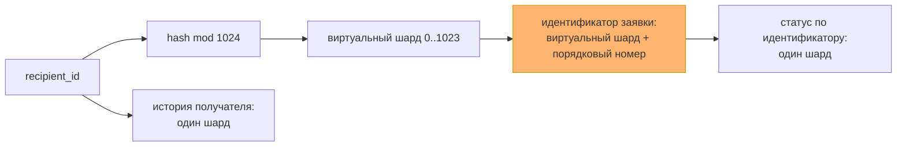
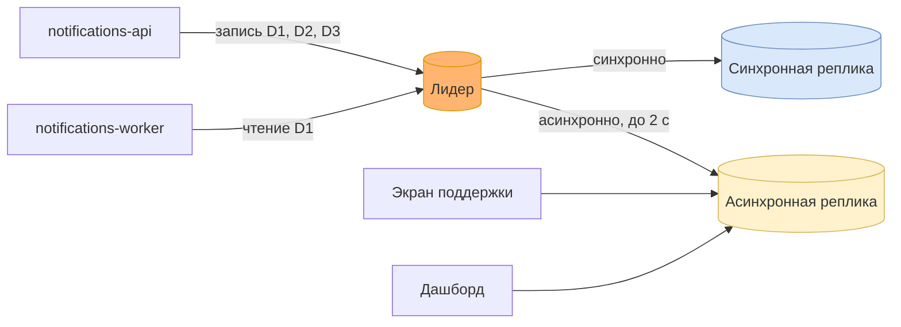

# Решение по данным сервиса уведомлений: хранилища, шарды и реплики

Это разбор с двадцать четвёртого занятия и первая половина **ДЗ-5**. Вторая половина — сборка
всего проекта в одно решение — лежит в [`22-final-solution.md`](22-final-solution.md).

Наборы данных я снова не выдумываю: беру те же шесть, что в
[модели согласованности](19-consistency-model.md#шаг-1-наборы-данных) и в
[кеш-стратегии](20-server-cache-strategy.md#шаг-1-что-читают-чаще-чем-меняют). Два прошлых
упражнения описывали их с двух сторон — насколько им нужна свежесть и сколько их читают. Здесь
третья сторона: где они живут и что с ними станет, когда их станет много.

Нагрузку беру из [разбора архитектуры](15-architecture-review.md): около 200 писем в обычный час
и 50 000 за десять минут в пик рассылки. Это примерно 1,8 миллиона заявок в год без рассылок
и до трёх миллионов с ними, у каждой заявки в среднем пять строк истории статусов.

## Шаг 1. Наборы данных: хранилище, согласованность, кеш

Сводная таблица, в которую сходятся оба прошлых упражнения. Колонка «хранилище» новая,
остальные две перенесены из документов 19 и 20 без изменений.

| Набор | Хранилище | Согласованность | Кеш | Как растёт |
|-------|-----------|-----------------|-----|------------|
| **D1. Заявка** | PostgreSQL, таблица заявок | ACID и CP | нет | ~3 млн строк в год |
| **D2. Статус и попытки** | PostgreSQL, история статусов | ACID для автора, BASE для остальных, окно 2 с | распределённый, cache-aside, TTL 2 с | ~15 млн строк в год |
| **D3. Ключи идемпотентности** | PostgreSQL, таблица ключей | ACID и CP | write-through, без вытеснения по памяти | не растёт: живут окно дедупликации, 7 суток |
| **D4. Шаблоны** | PostgreSQL, версии шаблонов | BASE и AP | два уровня, версия в ключе | сотни версий в год |
| **D5. Очередь и DLQ** | RabbitMQ | гарантии брокера | вне кеша | не растёт: очередь разбирается |
| **D6. Метрики** | проекция в PostgreSQL | BASE и AP | распределённый, TTL 60 с | ~500 строк в день |

Хранилищ по-прежнему два, и это осознанно. Всё, что требует транзакции, живёт в одной базе:
заявка, её статус и ключ идемпотентности пишутся одной операцией, и
[строгая зона](19-consistency-model.md#шаг-4-модель-под-каждый-набор) остаётся компактной.

## Шаг 2. Шардировать или нет

Решение принимается по набору, для всего сервиса сразу его не принимают. Растут только два
набора — D1 и D2, остальные либо малы, либо живут окном. Поэтому вопрос сводится к таблице заявок
и истории статусов.

Прохожу лестницу с занятия снизу вверх.

| Ступень | Что упирается у меня | Хватает? |
|---------|----------------------|----------|
| Индексы | чтение истории по получателю и статуса по идентификатору | да, оба запроса идут по индексу |
| Кеш | статус читают десятки раз | да, [кеш статуса](20-server-cache-strategy.md#шаг-3-паттерн-и-политика-вытеснения) уже стоит |
| Реплики чтения | поддержка и дашборд читают чужие заявки | да, см. шаг 3 |
| Мощнее узел | запись в пик | не понадобился: обычный сервер держит её с запасом |
| Шарды | запись и объём | нет необходимости |

Запись в пик — около 83 заявок в секунду и втрое больше строк статусов, то есть порядка
300 записей в секунду. Одна база PostgreSQL на обычном сервере держит это с запасом в десятки раз.
Объём — 18 миллионов строк в год, это тоже в пределах одного узла.

**Решение: шарды не вводим.** Шардирование здесь добавило бы сложность без выгоды: каждый отчёт
поддержки превратился бы в обход всех шардов, миграции схемы шли бы на каждом узле отдельно.
Всё это ровно те издержки преждевременного шардирования, что разбирались на занятии.

Вместо шардов беру **секционирование таблиц D1 и D2 по месяцу** внутри одной базы. Это range
по дате, и здесь он уместен: история статусов живёт двенадцать месяцев, и старая секция удаляется
целиком одной командой, без массового `DELETE`. Горячая последняя секция тут не проблема, а цель:
вся запись и так идёт в свежий месяц, а один узел её держит.

**Сигнал к пересмотру записан числом.** Шарды возвращаются в повестку, если выполнится любое из двух:
запись в пик устойчиво выше 3 000 в секунду, то есть вдесятеро больше сегодняшнего, или горячие
секции за год превысят 500 ГБ. Обе величины уже видны на
[дашборде](17-observability-plan.md#шаг-4-бюджет-ошибок-и-дашборд) как поток обработанных заявок
и размер базы.

**Ключ на будущее выбран уже сейчас.** Главные запросы к D1 и D2 — история по получателю
и статус по идентификатору заявки. Под первый напрашивается hash по `recipient_id`: вся история
получателя легла бы в один шард. Но тогда второй запрос, самый частый, превратился бы
в scatter-gather: по случайному идентификатору заявки шард не вычислить. Поэтому идентификатор
заявки начинает нести номер виртуального шарда, вычисленный из `recipient_id`. Это стоит
нескольких бит в идентификаторе сегодня и снимает переписывание всех клиентов потом. Решение
записано в [ADR 0008](adr/0008-requests-single-db-shard-ready-id.md).

1024 виртуальных шарда при одном физическом узле ничего не стоят. Когда узлов станет четыре,
каждый получит по 256 виртуальных, и переезд пойдёт целыми виртуальными шардами, а не заявками
поштучно.

## Шаг 3. Репликация и карта шардов

Шардов нет, а реплики нужны уже сейчас — для доступности и для разгрузки чтения. Каждому набору
своё правило, и оно вытекает из модели согласованности.

| Набор | Откуда пишем | Откуда читаем | Почему |
|-------|--------------|---------------|--------|
| **D1. Заявка** | лидер | только лидер | CP: воркер не может работать с заявкой, которой не видит |
| **D2. Статус**, автор заявки | лидер | лидер | read-your-writes, окно ноль |
| **D2. Статус**, поддержка | лидер | асинхронная реплика | окно 2 с, отставание реплики мониторится |
| **D3. Ключи** | лидер | только лидер | CP без исключений: промах означает дубль письма |
| **D4. Шаблоны** | лидер | лидер, дальше кеш | набор мал, чтение снимает кеш |
| **D6. Метрики** | лидер | асинхронная реплика | AP: минутная давность ничего не стоит |

Реплик две, и роли у них разные.

- **Синхронная реплика** держит D1 и D3 без потерь при отказе лидера: запись подтверждается,
  только когда она легла и на неё. Переключение на неё закрывает отказ базы — сбой, которого
  в перечне [тактик отказоустойчивости](16-resilience-tactics.md#шаг-1-типы-сбоев-и-тактика-под-каждый)
  не было, об этом ниже. Чтений на неё я не отправляю — её работа в том, чтобы быть готовой.
- **Асинхронная реплика** обслуживает чтения, которым хватает окна в 2 секунды: экран поддержки
  и дашборд. Отставание реплики становится метрикой с порогом 2 секунды, то есть ровно окном
  из модели согласованности.

Очередь живёт в RabbitMQ, и её репликацию задаёт брокер: кворумные очереди на трёх узлах.
Это решение брокера, и в таблицу выше оно не входит.

**Карта шардов.** Сегодня карты нет, потому что шард один. Место под неё выбрано заранее:
**в клиенте**, библиотекой внутри сервиса. Данными владеет один сервис, а `notifications-api`
и `notifications-worker` собираются [из одного образа](adr/0006-split-api-and-worker-deployments.md).
Значит главный минус карты в клиенте — рассинхрон версий между потребителями — у меня не возникает:
новая карта выкатывается обоими процессами одновременно. Координатор и прокси добавили бы узел
на пути каждого запроса, а выигрывать им тут нечего.

## Что задание поймало в уже принятых решениях

**Случайный идентификатор заявки закрывал дорогу к шардам.** До этого упражнения идентификатор
был обычным UUID, и это выглядело безобидно. Разбор ключа показал, что при любом будущем
шардировании по получателю самый частый запрос — статус по идентификатору — ушёл бы во все шарды.
Поправить это сейчас стоит формата идентификатора, потом — миграции всех заявок и всех клиентов.
Отсюда [ADR 0008](adr/0008-requests-single-db-shard-ready-id.md).

**Реплика чтения не должна попасть под проверку ключа.** В
[модели согласованности](19-consistency-model.md#что-задание-поймало-в-уже-принятых-решениях)
я записал, что проверка ключа идемпотентности требует строгой согласованности. Здесь это
превращается в конкретное правило: пул соединений к асинхронной реплике доступен только модулям
чтения для поддержки и дашборда. `notifications-api` о нём не знает вовсе, и случайно отправить
туда проверку ключа нельзя.

**Отказа базы не было в перечне сбоев.** [Тактики отказоустойчивости](16-resilience-tactics.md#шаг-1-типы-сбоев-и-тактика-под-каждый)
разбирали провайдера, копию приёма, брокер и всплеск рассылки, а единственная база сервиса стояла
в них молча, как нечто, что не падает. Синхронная реплика с переключением закрывает этот сбой,
и строку о нём надо дописать в документ 16 — тактика «резерв с переключением», мера — время
переключения.

**Отчёт за сутки уже был готов к шардам.** [Модель взаимодействия](12-interaction-model.md)
считает его проекцией заранее. Тогда это решалось ради редкого чтения, а здесь выяснилось второе
следствие: при шардировании отчёт не превратится в scatter-gather, потому что читает он проекцию.

## Как оформить это у себя

Это официальное **ДЗ-5**, срок сдачи 15.10, защиты нет — итог сдаётся артефактом.
По шагам, как на слайде задания:

1. **Сведите наборы данных в одну таблицу.** Если вы делали упражнения двадцать второго
   и двадцать третьего занятий, у вас уже есть согласованность и кеш по каждому набору.
   Добавьте хранилище и то, как набор растёт, — числом строк или гигабайт в год.
2. **Для растущего набора пройдите лестницу снизу вверх**: индексы, кеш, реплики, мощнее узел, шарды.
   Остановитесь на первой ступени, которой хватает, и запишите число, при котором решение
   пересматривается. Если шарды всё же нужны — назовите ключ по главному запросу и проверьте
   второй по частоте запрос: не уходит ли он во все шарды.
3. **Назначьте репликацию по модели согласованности**: строгие наборы читаются с лидера,
   остальные могут уйти на реплику с окном, равным окну свежести. И выберите место для карты
   шардов — даже если шард пока один, место стоит назвать.
4. **Соберите итоговое решение** — как это сделано в [`22-final-solution.md`](22-final-solution.md):
   декомпозиция, взаимодействие, надёжность и данные, со ссылками на ваши документы.

Отказ от шардирования — нормальный результат этого задания. Требуется обоснование: какая
ступень лестницы закрыла нагрузку и при каком числе вы вернётесь к вопросу.
