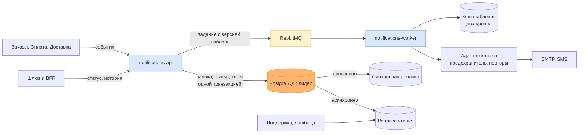

# Итоговое архитектурное решение: сервис уведомлений целиком

Это вторая половина **ДЗ-5** и последний документ курса. Отдельных новых решений здесь нет:
всё, что ниже, уже принято в прошлых заданиях. Задача документа другая — показать, что эти
решения складываются в одну систему, а не в набор отдельных упражнений, и что каждое из них
выводится из трёх драйверов, с которых всё началось.

Драйверы из [корневого README](../README.md): **D1** — всплески нагрузки во время рассылок,
**D2** — никаких потерь и дублей для получателя, **D3** — ненадёжные внешние провайдеры.

## Декомпозиция: что за сервис и где его границы

Уведомления — отдельный сервис с одной ответственностью: доставить сообщение получателю
по событию из другого контекста. «Заказы», «Оплата» и «Доставка» публикуют события и ничего
не знают о каналах и провайдерах.

| Решение | Документ | Какой драйвер держит |
|---------|----------|----------------------|
| Уведомления выделены в отдельный сервис | [`05-service-boundaries.md`](05-service-boundaries.md), [ADR 0002](adr/0002-notifications-as-separate-service.md) | D3: сбой провайдера не задевает заказ |
| Границы проверены сплочённостью и связанностью | [`06-cohesion-coupling.md`](06-cohesion-coupling.md) | все три |
| Границы независимо перепроверены доской событий | [`07-event-storming.md`](07-event-storming.md), [`views/context-map.md`](views/context-map.md) | все три |

## Взаимодействие и доступ: кто кого вызывает и кто что видит

| Решение | Документ | Какой драйвер держит |
|---------|----------|----------------------|
| Доставка асинхронная, через очередь | [`12-interaction-model.md`](12-interaction-model.md), [ADR 0001](adr/0001-async-delivery-via-queue.md) | D1 и D3: очередь гасит пик и переживает провайдера |
| Приём идемпотентен по ключу события | [`19-consistency-model.md`](19-consistency-model.md#шаг-4-модель-под-каждый-набор) | D2: повтор не даёт второго письма |
| Вход через общий шлюз и BFF | [`09-entry-layer.md`](09-entry-layer.md), [ADR 0003](adr/0003-entry-layer-gateway-and-bff.md) | — |
| Принадлежность заявки проверяет сам сервис | [`13-auth-model.md`](13-auth-model.md), [ADR 0005](adr/0005-access-check-in-service.md) | — |

## Надёжность и наблюдаемость

| Решение | Документ | Какой драйвер держит |
|---------|----------|----------------------|
| Приём и обработка — два Deployment из одного образа | [`14-kubernetes-objects.md`](14-kubernetes-objects.md), [ADR 0006](adr/0006-split-api-and-worker-deployments.md) | D1: воркеры масштабируются отдельно |
| Предохранитель, таймауты и повторы на адаптере канала | [`16-resilience-tactics.md`](16-resilience-tactics.md) | D3 |
| SLI, SLO, алерты и дашборд | [`17-observability-plan.md`](17-observability-plan.md) | D2: потеря видна раньше жалобы |

## Данные и кеш

| Решение | Документ | Какой драйвер держит |
|---------|----------|----------------------|
| Строгие наборы — заявка, статус для автора, ключи — в одной базе | [`19-consistency-model.md`](19-consistency-model.md) | D2 |
| Версия шаблона фиксируется в задании | [ADR 0007](adr/0007-template-version-pinned-in-job.md) | D2: одна рассылка — один текст |
| Кеш шаблонов в два уровня, ключи идемпотентности без вытеснения | [`20-server-cache-strategy.md`](20-server-cache-strategy.md) | D1 |
| Шардов нет, идентификатор заявки готов к ним | [`21-data-scaling.md`](21-data-scaling.md), [ADR 0008](adr/0008-requests-single-db-shard-ready-id.md) | D1 |
| Синхронная реплика для строгих наборов, асинхронная для чтения поддержки | [`21-data-scaling.md`](21-data-scaling.md#шаг-3-репликация-и-карта-шардов) | D2 |

## Система одной картинкой

Контейнерная диаграмма в [`views/c4-container.md`](views/c4-container.md) остаётся верной:
реплики — это копии контейнера PostgreSQL, а кеш живёт внутри приложения и рядом с ним.

## Что осталось открытым

Три вопроса я записываю как открытые, а не как решённые, и у каждого есть условие, при котором
к нему вернусь.

1. **Шарды.** Возвращаются при записи в пик выше 3 000 в секунду или 500 ГБ горячих секций
   в год, см. [ADR 0008](adr/0008-requests-single-db-shard-ready-id.md).
2. **Отказ базы в тактиках отказоустойчивости.** Найден на двадцать четвёртом занятии,
   строку надо дописать в [`16-resilience-tactics.md`](16-resilience-tactics.md).
3. **Второй регион.** Не рассматривался вовсе: драйверы его не требуют. Появится требование
   к доступности при потере площадки — начинать с модели согласованности, а не с репликации.

## Как оформить это у себя

Итоговый документ не пересказывает прошлые задания, он собирает ссылки на них. Порядок такой:

1. Выпишите драйверы своей темы — те, с которых вы начинали на первых занятиях.
2. Разложите принятые решения по четырём разделам: декомпозиция, взаимодействие и доступ,
   надёжность и наблюдаемость, данные. Каждой строке — ссылка на документ или ADR.
3. Рядом с каждым решением назовите драйвер, который оно держит. Решение, у которого драйвера
   нет, — повод перечитать его: либо драйвер забыт, либо решение лишнее.
4. Нарисуйте систему одной схемой и запишите, что осталось открытым и при каком условии вы к этому
   вернётесь.

Защиты по курсу нет: этот документ и есть итог, по нему проверяется ДЗ-5.
