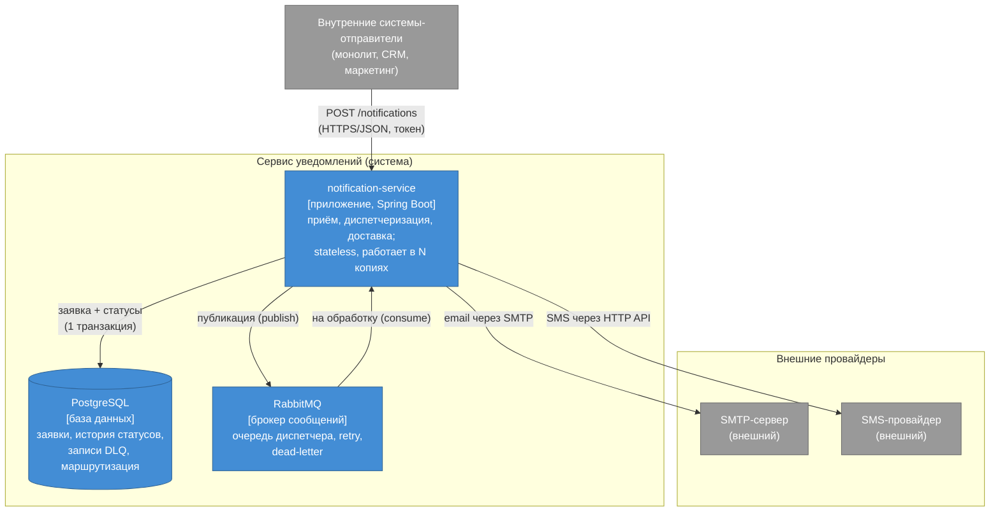

# C4, уровень 2 — Containers

Здесь я делаю первый зум внутрь: из каких частей собрана система. И тут важно не смошенничать с определением. Контейнер в C4 — это то, что **разворачивается отдельно**: приложение, база данных, брокер сообщений. Не класс, не модуль, а именно самостоятельная единица развёртывания. По этому критерию у нашей системы ровно три контейнера.

## Диаграмма

## Три контейнера и откуда какие требования

**notification-service** — само приложение. Оно принимает заявку (проверяет токен — безопасность, S5; и ключ идемпотентности — S2), в одной транзакции пишет заявку с историей статусов в базу и публикует сообщение в брокер. Оно же потом читает это сообщение обратно, выбирает канал и доставляет через провайдера, а при сбое повторяет и в конце уводит безнадёжное в dead-letter (надёжность, S1). Приложение stateless и поднято в нескольких копиях за балансировщиком — это доступность из S3.

**PostgreSQL** — состояние системы: заявки, история статусов, записи DLQ, таблица маршрутизации «канал → провайдер».

**RabbitMQ** — брокер. Он разъединяет приём и доставку: приём складывает сообщение в очередь и сразу отвечает, а разбирают её воркеры приложения в своём темпе. Этот буфер и гасит пики (масштабируемость, S4), а очереди retry и dead-letter внутри брокера реализуют повторы и отстойник для недоставленного.

Обрати внимание на две стрелки между приложением и RabbitMQ — publish и consume. Это и есть асинхронность: одно и то же приложение и кладёт в очередь, и разбирает её, но развязано во времени. На стыке «запись в БД + публикация в брокер» живёт компромисс из [`03-tradeoffs.md`](../03-tradeoffs.md) — рекомендую перечитать вместе с этой картинкой.

## Почему адаптеры и диспетчер тут не нарисованы

Резонный вопрос: а где SMTP-адаптер, SMS-адаптер, диспетчер? Они внутри приложения `notification-service` — это его **компоненты**, а не отдельные контейнеры: разворачиваются вместе с ним, в одном процессе. Показывать их на уровне контейнеров было бы враньём против нашего же определения «контейнер = отдельная единица развёртывания».

Для внутренностей приложения существует следующий уровень C4 — **Component**. В этом ДЗ он не требуется (нам хватает Context и Containers), но если однажды захочется показать, как внутри устроены приём, диспетчер и адаптеры и как они ходят в очереди retry/DLQ, — вот ровно для этого и нужен третий уровень. Это, кстати, и есть ответ на вопрос «зачем в C4 уровни»: каждый отвечает на свой вопрос и своей аудитории.

## Исходник

Редактируемая версия — [`diagrams/c4-container.drawio`](diagrams/c4-container.drawio). Картинку при желании экспортируйте в `diagrams/c4-container.png`.
