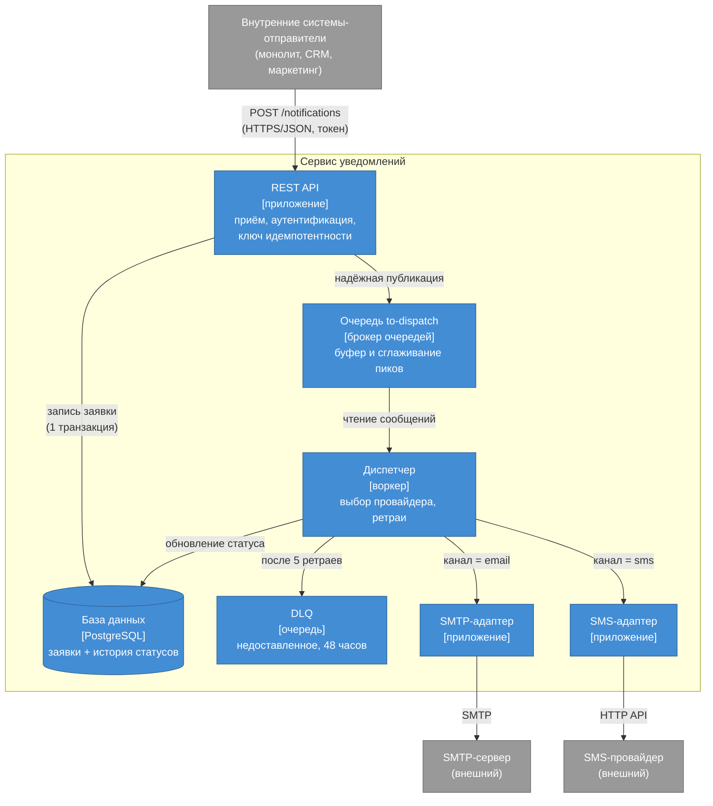

# C4, уровень 2 — Containers

Здесь я делаю первый зум внутрь: из каких частей сервис собран. Контейнер в терминах C4 — это то, что запускает приложение или хранит данные и разворачивается отдельно. Аудитория тут уже другая, техническая: команда, которой предстоит это строить и эксплуатировать.

## Диаграмма

## Как это работает и откуда какие требования

Заявка приходит в REST API. Он проверяет токен (это безопасность, S5) и ключ идемпотентности (защита от дублей, S2), в одной транзакции пишет заявку в базу и надёжно кладёт сообщение в очередь `to-dispatch`. Вот на этом стыке базы и очереди и живёт компромисс, который я разбирал в [`03-tradeoffs.md`](../03-tradeoffs.md) — рекомендую перечитать вместе с этой картинкой.

Очередь работает буфером и гасит пики (масштабируемость, S4): всплеск принимается сразу, а разбирают его воркеры в своём темпе. Диспетчер читает очередь, выбирает адаптер по каналу и доставляет; если провайдер молчит, он делает до пяти повторов, а безнадёжное уводит в DLQ (надёжность, S1). Адаптеры прячут за собой конкретного провайдера — захотим завтра push, добавим ещё один адаптер, ядра не касаясь.

Отдельно отмечу одну вещь, которая на диаграмме не написана словами, но в неё заложена: приём и доставка разнесены и масштабируются независимо. Приём вдобавок stateless и стоит за балансировщиком в нескольких копиях — это и есть доступность из S3.

## Дальше не идём

Уровень 3 (Components) я здесь рисовать не стал. На вебинаре мы договорились, что Context и Containers обычно закрывают потребность, а компоненты имеет смысл доставать только для какого-то одного сложного контейнера, когда он реально того просит. Сейчас — не просит.

## Исходник

Редактируемая версия — [`diagrams/c4-container.drawio`](diagrams/c4-container.drawio). Картинку при желании экспортируйте в `diagrams/c4-container.png`.
