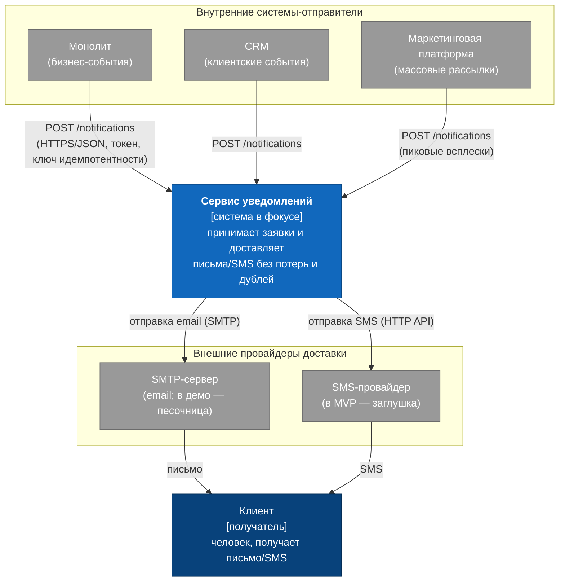

# C4, уровень 1 — System Context

Это самый общий взгляд: про что вообще система, кто ей пользуется и с чем она связана. Я держу в голове аудиторию этой диаграммы — стейкхолдер или новичок, который должен за минуту понять картину, не проваливаясь внутрь. Поэтому здесь ни слова про то, как сервис устроен изнутри; это следующий уровень.

## Диаграмма

## Что здесь видно

В центре — сервис уведомлений, единственное, за что мы отвечаем. Сверху сидят внутренние отправители: монолит, CRM и маркетинг. Все они стучатся одинаково, `POST /notifications`, с токеном и ключом идемпотентности. Маркетинг я вынес отдельно не просто так — это источник пиков, тот самый драйвер D1.

Снизу — внешние провайдеры, SMTP и SMS. Они не в нашей зоне ответственности и, что важнее, ненадёжны (драйвер D3); в демо это и вовсе песочница и заглушка. Ещё ниже — конечный получатель, живой человек, до которого доходит письмо или SMS.

Как сервис добивается доставки без потерь — на этой картинке специально не показано. Это уже следующий уровень, [Containers](c4-container.md).

## Исходник

Редактируемая версия лежит в [`diagrams/c4-context.drawio`](diagrams/c4-context.drawio) — открывается на [app.diagrams.net](https://app.diagrams.net). Если нужна картинка, экспортируйте оттуда в `diagrams/c4-context.png` (File → Export as → PNG).
