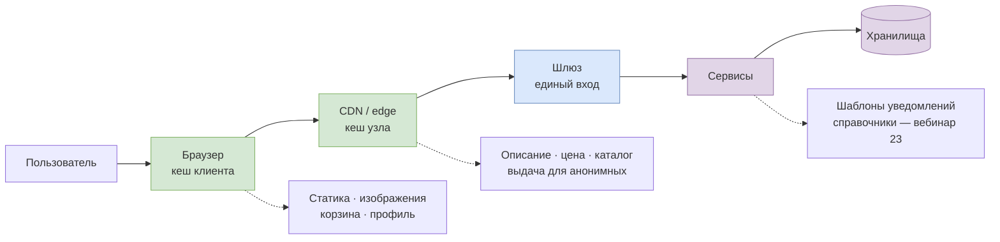
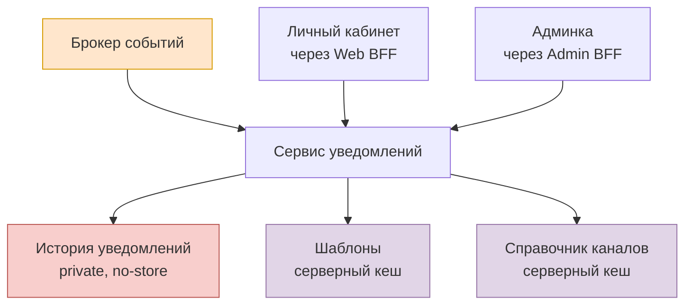

# Точки кеширования: схема

Две картинки. Первая показывает путь запроса и то, где ответ может осесть, не доходя до origin. Вторая делает зум внутрь уведомлений и объясняет, почему у этого сервиса на схеме кеша почти нет.

Разметка данных по точкам разобрана в [`10-cache-points.md`](../10-cache-points.md), стратегии инвалидации — в [`11-invalidation-strategy.md`](../11-invalidation-strategy.md), решение по истории уведомлений записано в [ADR-0004](../adr/0004-notification-history-not-cached.md).

## Путь запроса и точки кеша

Зелёным — то, что мы разбирали сегодня: браузер и edge. Сиреневым — серверный кеш, он остаётся на вебинар 23. Шлюз кеша не держит: он про маршрутизацию и политики, а не про хранение ответов.

## Зум внутрь: почему у уведомлений кеша нет

Основной вход в сервис — событие из брокера, оранжевым. Кеша он не касается вовсе: это запись, а не чтение. Наружу сервис отдаёт три вещи, и ни одна не попадает на edge — история адресная и помечена красным как некешируемая в общем кеше, шаблоны и справочники живут в серверном кеше.

Это и есть ответ на вопрос, который возникает при разметке: **отсутствие данных на CDN — свойство сервиса, а не пробел в задании.**
