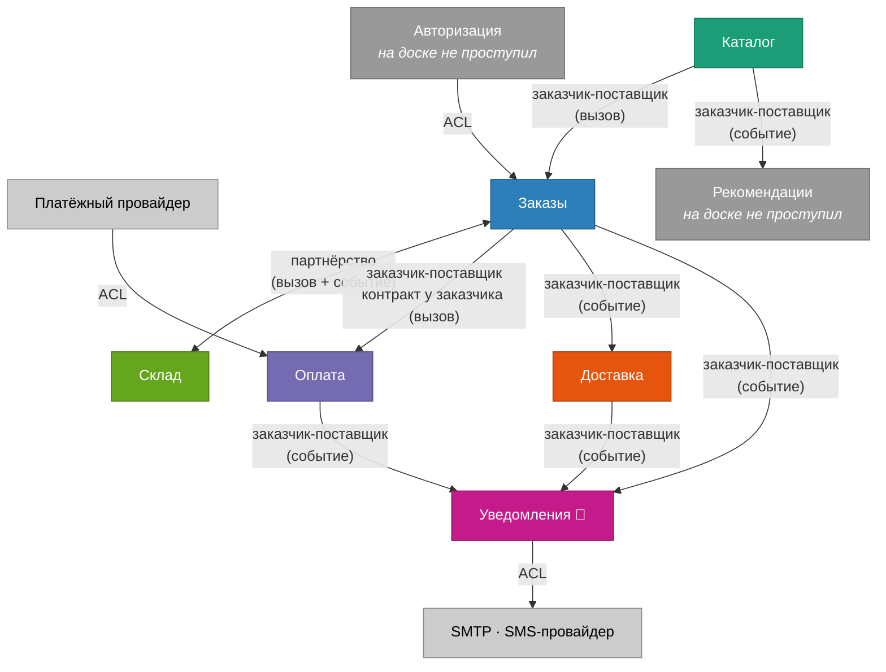

# Context Map

Контексты найдены в [`07-event-storming.md`](../07-event-storming.md), здесь — связи между ними. Это отдельное представление, и вопрос у него свой: не «из чего состоит система», а **кто от кого зависит и кто под кого подстраивается при изменениях**.

## Три типа связей

На карте у каждой стрелки должен быть тип, иначе это просто картинка со стрелками.

**Партнёрство.** Контексты меняются согласованно, одним релизом. Ни один не может изменить контракт в одностороннем порядке. Самая дорогая связь: она означает, что две команды обязаны договариваться постоянно.

**Заказчик-поставщик.** Один контекст выше по потоку, другой ниже. Поставщик даёт контракт, заказчик под него подстраивается. Отдельно важно, **кто контрактом владеет**: обычно поставщик, но бывает и наоборот, и это принципиально разные ситуации.

**ACL (anti-corruption layer).** Чужая модель останавливается на границе и переводится в нашу. Ставим там, где не хотим, чтобы внешняя терминология протекла внутрь.

## Карта

Редактируемая версия — [`diagrams/context-map.drawio`](diagrams/context-map.drawio).

## Разбор связей

### Каталог → Заказы: заказчик-поставщик

Заказы спрашивают карточку товара при добавлении позиции. Каталог выше по потоку и контрактом владеет он: как устроена карточка, решает каталог, а заказы под это подстраиваются. Обратной зависимости нет — каталог продолжит работать, даже если заказы исчезнут.

### Заказы ↔ Склад: партнёрство

Единственная двусторонняя связь на карте, и самая дорогая. Заказы просят зарезервировать товар; склад по своей политике снимает резерв через 30 минут и этим меняет судьбу заказа. Инвариант «резерв держится, пока заказ не оплачен» принадлежит обоим сразу — ни один не может изменить правило в одиночку.

Тут же живёт [первый hotspot](../07-event-storming.md#что-видно-на-доске): оплата пришла, а резерв уже снят. Ответ на этот вопрос потребует согласованной правки обоих контекстов — что и есть определение партнёрства.

Стоит ли из-за этого слить их в один контекст? Я проверил и не сливаю: у них разный язык (остаток и резерв против заказа и статуса) и разные причины меняться. Но это самое напряжённое место карты, и если система будет усложняться, я в первую очередь посмотрю сюда.

### Заказы → Оплата: заказчик-поставщик, контракт у заказчика

Необычный случай, на который стоит обратить внимание. По потоку поставщиком выглядит оплата — это она оказывает услугу. Но контракт «списать сумму по заказу» описан **на стороне заказов**, и оплата под него подстраивается. Это [тот самый DIP из ДЗ №3](../06-cohesion-coupling.md#один-приём-solid-dip): абстракция принадлежит верхнему уровню.

Практический смысл — сменить платёжного провайдера или всю интеграцию можно, не открывая код заказов. Если бы контракт диктовала оплата, каждая смена провайдера протекала бы в ядро.

### Заказы, Оплата, Доставка → Уведомления: заказчик-поставщик через событие

Три одинаковые по типу связи. Поставщик — издатель события, он владеет контрактом: «заказ оформлен» выглядит так, как решили заказы. Уведомления ниже по потоку и подстраиваются.

Важно, чего здесь **нет**: обратной стрелки. Уведомления ничего не возвращают в магазин — ни статуса, ни подтверждения. Издатель опубликовал факт и живёт дальше, он даже не знает, что у события есть подписчик. Это и есть [развязка из ADR-0002](../adr/0002-notifications-as-separate-service.md): недоступность SMTP не может дойти до оформления заказа, потому что дороги обратно просто не существует.

Расплата за это честная и записана в том же ADR: узнать судьбу конкретного письма издатель тоже не может — за этим надо идти в историю статусов уведомлений.

### Уведомления → SMTP и SMS: ACL

У каждого провайдера свой формат, свои коды ошибок и своё представление о том, что такое «доставлено». Если пустить это внутрь, наша модель начнёт зависеть от того, какой провайдер сегодня подключён.

Поэтому на границе стоит перевод: адаптер принимает чужой ответ и превращает его в одно из трёх наших состояний — доставлено, временный сбой, окончательный отказ. Дальше внутри сервиса никто не знает, что такое SMTP-код. Технически это [те самые адаптеры за интерфейсом «провайдер канала»](../06-cohesion-coupling.md#один-приём-solid-dip): DIP и ACL здесь — один и тот же приём, увиденный с разных сторон.

### Платёжный провайдер → Оплата: ACL

Ровно та же логика на другой границе. Чужая модель платежа останавливается на адаптере, внутрь идёт наш платёж.

### Авторизация → все: ACL

Контекст, который [на доске не проступил](../07-event-storming.md#расхождение-1-два-сервиса-на-доске-не-появились), но на карте нужен: без него непонятно, откуда берётся право совершить действие. Токен проверяется на входе каждого контекста, и чужая модель пользователя дальше проверки не идёт.

## Что карта говорит про риски

Самое полезное на этой картинке — распределение типов.

**Партнёрство ровно одно** — Заказы ↔ Склад. Это хорошо: партнёрство означает обязательную координацию при каждом изменении, и чем его меньше, тем дешевле развивать систему. Если бы партнёрств оказалось три-четыре, я бы вернулся к границам и пересмотрел их.

**Все связи с уведомлениями односторонние и событийные.** Наш сервис никого не задерживает и ни на кого не влияет — самое безопасное положение для generic-подсистемы, которая ходит во внешний мир и потому регулярно сбоит.

**Все выходы во внешний мир закрыты ACL.** Ни одна чужая модель не проходит внутрь. Это не бюрократия: именно ACL позволяет сменить провайдера без правок в ядре.

Отдельно замечу, чего типизация не показывает. В ДЗ №3 главным риском выглядела [связанность по данным](../06-cohesion-coupling.md#риск-2-уведомления-сами-лезут-за-контактами-получателя) — когда сервис лезет в чужую базу. На Context Map такая связь не появится вообще: у неё нет стрелки, она идёт под столом. Так что карта отвечает на вопрос «как контексты договорились общаться», но не проверяет, что все действительно общаются только так.
