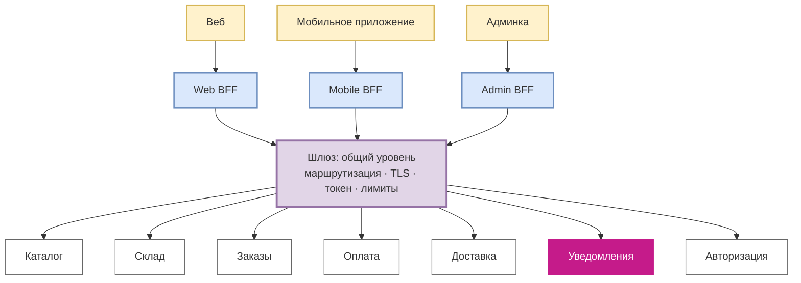
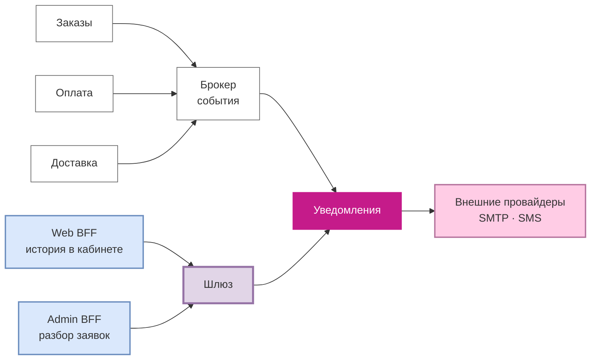

# Слой входа: схема

Две картинки. Первая отвечает на вопрос задания «клиент → шлюз / BFF → сервисы» на уровне магазина. Вторая делает зум внутрь и показывает то, что на общей схеме теряется: у сервиса уведомлений два входа, и только один из них проходит через шлюз.

Решения, которые здесь нарисованы, разобраны в [`09-entry-layer.md`](../09-entry-layer.md) и записаны в [ADR-0003](../adr/0003-entry-layer-gateway-and-bff.md).

## Клиент → шлюз / BFF → сервисы

Розовым — наш сквозной сервис, цвет тот же, что на [карте сервисов](service-map.md) и [Context Map](context-map.md). Рекомендации на схему не вынес: на экране заказа их нет, а плодить стрелки ради полноты не хочется.

Три BFF стоят над общим уровнем, а не вместо него. Всё, что одинаково для любого запроса — проверка токена, лимиты, единый адрес, — живёт этажом ниже и не дублируется трижды. Наверху остаётся только то, что зависит от клиента: какие поля собрать и в какой форме отдать.

## Зум: два входа в сервис уведомлений

Левый путь — работа: издатели публикуют события, сервис их разбирает и доставляет. Шлюза здесь нет и быть не должно, так решено в [ADR-0002](../adr/0002-notifications-as-separate-service.md).

Правый путь — чтение: история заявок в личном кабинете и разбор в админке. Он идёт через шлюз, как у всех остальных сервисов.

Если нарисовать только первую схему, получится, что уведомления — обычный сервис за шлюзом. Это неправда ровно наполовину, и вторая картинка нужна именно затем, чтобы эту половину не потерять.

## Редактируемые исходники

[`diagrams/entry-layer.drawio`](diagrams/entry-layer.drawio) — та же общая схема в draw.io, если удобнее править мышкой. Mermaid считаю основным: он лежит в тексте, виден прямо на GitHub и правится в том же коммите, что и рассуждение рядом.
