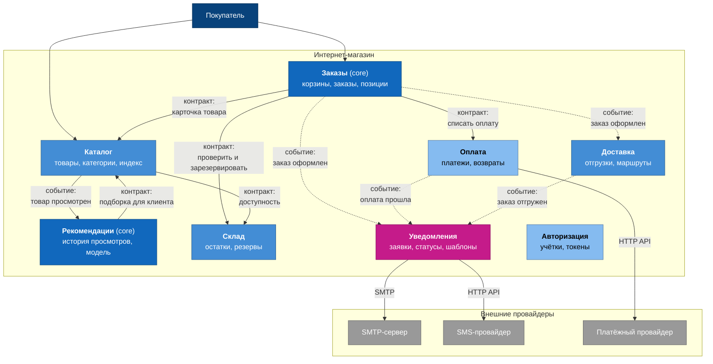

# Карта сервисов

Здесь всё, что разобрано в [`04-capabilities.md`](../04-capabilities.md), [`05-service-boundaries.md`](../05-service-boundaries.md) и [`06-cohesion-coupling.md`](../06-cohesion-coupling.md), сведено в одну картинку. Сервисы, чем каждый владеет и что передаётся по связям.

Это не C4: там мы смотрели на один сервис в его окружении, здесь — на всю систему сразу. Уровня «карта сервисов» в C4 формально нет, и это нормально, представление выбирается под вопрос, на который оно отвечает. Наш вопрос — где проходят границы и как части общаются.

## Диаграмма

Сплошная стрелка — синхронный вызов по контракту, пунктирная — асинхронное событие. Цвет показывает тип поддомена: тёмно-синий core, светлее supporting, самый светлый generic. Розовым выделен сервис, который мы ведём через весь курс.

Авторизация стоит на карте без стрелок намеренно. Её токен проверяет каждый сервис на входе, и если нарисовать все связи, получится восемь линий, которые перечеркнут схему и ничего не объяснят. Сквозные вещи — авторизацию, логирование, трассировку — честнее один раз назвать словами, чем размазывать по картинке.

## Что на этой картинке важно

**Ни одной стрелки в чужую базу.** Все связи подписаны: либо контракт, либо событие. Если бы на схеме появилась линия «Уведомления → база профиля», это был бы [риск 2](../06-cohesion-coupling.md#риск-2-уведомления-сами-лезут-за-контактами-получателя) — но такие связи обычно на схему и не попадают, их приходится выискивать вопросами.

**Уведомления не вызывает никто.** В сервис уведомлений входят только пунктирные стрелки — события. Это прямое следствие [риска 1](../06-cohesion-coupling.md#риск-1-каждый-сервис-шлёт-письма-сам): издатель публикует факт и живёт дальше, он не знает ни про каналы, ни про то, что подписчик вообще существует. Обратных стрелок от уведомлений в магазин нет вовсе — сервис ничего не возвращает бизнесу, кроме статусов у себя.

**Сплошные стрелки идут только к supporting и generic.** Ни один сервис не вызывает синхронно чужой core. Это не случайность и хороший признак: синхронный вызов делает вас заложником доступности того, кого вызываете, и подставлять под это ядро бизнеса не стоит.

**Стрелки между Каталогом и Рекомендациями идут в обе стороны** — и это самое напряжённое место карты. Каталог шлёт событие о просмотре, рекомендации просят карточки для подборки. Двусторонняя связь всегда повод перепроверить границу: не один ли это сервис? Я проверил и всё-таки не сливаю ([разные причины меняться и разный профиль нагрузки](../05-service-boundaries.md#2-рекомендации-возможность-2)), но держу в голове как основной риск декомпозиции.

## Где здесь DIP

На схеме его не видно, и это нормально — DIP живёт не в стрелках, а в том, кому принадлежит контракт. Два примера разобраны в [`06-cohesion-coupling.md`](../06-cohesion-coupling.md#один-приём-solid-dip): диспетчер уведомлений владеет интерфейсом «провайдер канала», а реализуют его адаптеры SMTP и SMS; сервис Заказы владеет контрактом «списать оплату», а не зависит от конкретной интеграции.

Проверить легко: если контракт описан на стороне того, кто его вызывает, — DIP есть. Если на стороне того, кого вызывают, — стрелка зависимости смотрит вниз, и это обычная зависимость.

## Исходник

Редактируемая версия — [`diagrams/service-map.drawio`](diagrams/service-map.drawio), открывается на [app.diagrams.net](https://app.diagrams.net).
